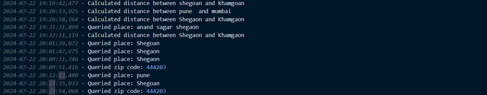

# LocaFinder

LocaFinder is a versatile Python tool for geographic and location-based queries. It allows users to get detailed information about places, coordinates, and zip codes, calculate distances between two places, batch process multiple inputs, visualize locations on a map, and fetch weather information.

## Features

1. **Get details of a place**: Enter the name of a place to get detailed information including address, latitude, longitude, and nearby places.
2. **Get details with Latitude / Longitude**: Enter latitude and longitude to get the location address.
3. **Find details of a Zip Code**: Enter a zip code to get information such as city, state, country, latitude, and longitude.
4. **Calculate distance between two places**: Enter the names of two places to calculate the distance between them.
5. **Batch process multiple inputs**: Enter multiple place names, coordinates, or zip codes to get information in batch mode.
6. **Visualize location on map**: Enter the name of a place to generate a map with the location marked.
7. **Fetch weather information**: Enter the name of a place to fetch current weather information.





## Requirements

- Python 3.x
- `geopy` library
- `requests` library
- `folium` library

## Installation

1. **Clone the repository**:

```sh
git clone https://github.com/your-username/LocaFinder.git
cd LocaFinder
```

2. **Install the required libraries:**
   
   pip install geopy requests folium

# Usage

**Run the script:**

python LocaFinder.py

Follow the on-screen prompts to use various features of the tool.

## Batch Processing

- Enter multiple place names: Provide a comma-separated list of place names.

- Enter multiple coordinates: Provide a semicolon-separated list of coordinates (lat1,lon1;lat2,lon2;...).

- Enter multiple zip codes: Provide a comma-separated list of zip codes.

## Weather Information

Replace 'YOUR_OPENWEATHERMAP_API_KEY' in the script with your actual OpenWeatherMap API key to fetch weather information.

## Signal Handling

The script gracefully handles Ctrl+C (SIGINT) to terminate the program successfully.

## Logging

The tool logs all queries to geotool.log for reference.

## Example

Here's an example of how to use LocaFinder:

1. **Start the script:**

python LocaFinder.py

2.  **Select an option from the menu, such as getting details of a place:**

```sh
[1] Get details of a place
[2] With Latitude / Longitude
[3] Find details of a Zip Code
[4] Calculate distance between two places
[5] Batch process multiple inputs
[6] Visualize location on map
[7] Fetch weather information
[8] EXIT!!!
```

3. **Follow the prompts to enter the required information.**

# Contributing

Contributions are welcome! Please create a pull request with a detailed description of your changes.

## License

This project is licensed under the MIT License.

**Created by**: [Kunal Namdas]

```sh
Replace `[Kunal Namdas]` with your actual name and update the GitHub repository URL with the correct one. This `README.md` provides a comprehensive overview of your project, including features, installation instructions, usage, and contribution guidelines.
```
